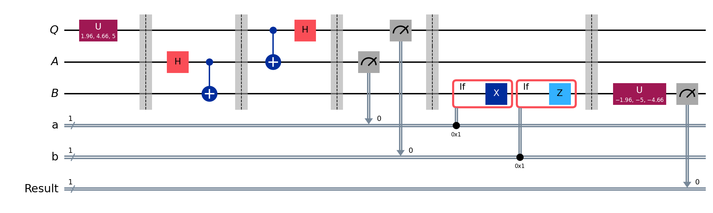
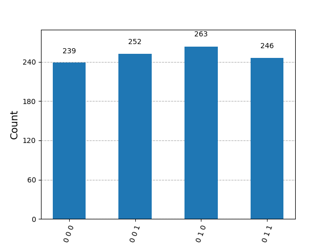

# Quantum Teleportation in Qiskit

This project shows quantum teleportation using Qiskit. The state of one qubit is sent to another qubit using entanglement and two classical bits.

## The setup

- **Q** is the qubit Alice wants to teleport. I give it a random state.
- **A and B** are the entangled pair (the ebits). Alice has A and Bob has B.

## The steps

1. Alice makes the entangled pair A and B.
2. Alice does her operations on Q and A.
3. Alice measures Q and A and gets two classical bits.
4. Bob uses those two classical bits to apply his operations (X and/or Z) on B.
5. Now B has the state that Q had, so the state is teleported.

## Checking it worked

To check, I apply the reverse of the random state gate on B and measure it. If teleportation worked, the result is always 0.

## Circuit

## Result

I ran the circuit 1000 times on a simulator.

The first bit (the Result bit) is always 0 in all the bars. This means the state was teleported correctly every time.

## How to run

1. Install the requirements: `pip install -r requirements.txt`
2. Open `teleportation.ipynb` in Jupyter.
3. Run all the cells from the top.

## Tools used

Python, Qiskit, Qiskit Aer, Jupyter Notebook
